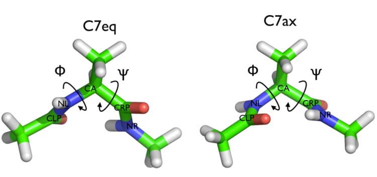

# PLUMED Masterclass 21.4: Metadynamics

## Origin

This masterclass was authored by Max Bonomi on March 1, 2021.

## Aims

The aim of this Masterclass is to train users to perform and analyze a metadynamics simulation with PLUMED.

## Objectives

Once this Masterclass is completed, users will be able to:

- Write the PLUMED input file to perform metadynamics simulations.
- Calculate the free energy as a function of the metadynamics collective variables.
- Unbias metadynamics simulations.
- Estimate the error in the reconstructed free energies using block analysis.
- Assess the convergence of metadynamics simulations.
- Recognize good from bad collective variables.
 
## Overview of the theory 

PLUMED can be used not only to analyze a pre-existing MD trajectory, but also to add forces on the CVs during a MD simulation, for example, in order to accelerate sampling. To this aim, we have implemented a variety of possible biases acting on CVs.  The complete documentation for all the biasing methods available in PLUMED can be found at the [page of the manual on biasing](https://www.plumed.org/doc-master/user-doc/html/_bias.html).  In the following tutorial we will learn how to use PLUMED to perform and analyze a metadynamics simulation.  Users are invited to familiarize with the theory behind this method by looking at one of the many reviews on this topic that are available.  Some good places to look include: 

- Alessandrio Laio and Francesco Luigi Gervasio. [Metadynamics: a method to simulate rare events and reconstruct the free energy in biophysics, chemistry and material science.](https://iopscience.iop.org/article/10.1088/0034-4885/71/12/126601) Rep. Prog. Phys., 71:126601, 2008.
- Alessandro Barducci, Massimiliano Bonomi, and Michele Parrinello. [Metadynamics.](https://wires.onlinelibrary.wiley.com/doi/full/10.1002/wcms.31) Wiley Interdisciplinary Reviews: Computational Molecular Science, 1(5):826–843, 2011.
- Ludovico Sutto, Simone Marsili, and Francesco Luigi Gervasio. [New advances in metadynamics.](https://wires.onlinelibrary.wiley.com/doi/10.1002/wcms.1103) Wiley Interdisciplinary Reviews: Computational Molecular Science, 2(5):771–779, 2012.
- Giovanni Bussi, Davide Branduardi, and others. [Free-energy calculations with metadynamics: Theory and practice.](https://onlinelibrary.wiley.com/doi/10.1002/9781118889886.ch1) Rev. Comput. Chem, 28:1–49, 2015.

You can find a summary of the theory in this [supplementary file](THEORY.html )..

## Setting up the software 

The users can refer to the procedures introduce in [this masterclass](https://plumed-school.github.io/lessons/21/001/data/) and [this masterclass](https://plumed-school.github.io/lessons/21/003/data/) to get instructions on how to install the required software.  In this class, we will perform the simulations ourselves, so make sure that [GROMACS](https://www.gromacs.org) code is properly installed.

## Resources

The data needed to complete the exercises of this Masterclass can be found on [GitHub](https://github.com/plumed/masterclass-21-4).  You can clone this repository locally on your machine using the following command:

````
git clone https://github.com/plumed/masterclass-21-4.git
````

This repositoy contains 3 folders:

- `data`: GROMACS topology/PDB files for the two systems that we are going to simulate and python script for error analysis;
- `notebooks`: Jupyter notebook to be used as template for the analysis of the PLUMED output;
- `slides`: a brief presentation of the metadynamics theory.  

To keep things clean, it is recommended to run each exercise in a separate sub-directory (i.e. Exercise-1, Exercise-2, ...), which you can create inside the root directory `masterclass-21-4`. Students are invited to solve the exercises by themselves after completing the PLUMED input file templates provided below. In case of problems, students can rely on the solution notebook `solution.ipynb` provided in the [GitHub](https://github.com/plumed/masterclass-21-4) repository. 

In many exercises, in the following tutorial we will play with a toy system, alanine dipeptide simulated in vacuo.  An image of this molecule is shown below: 


This rather simple molecule is useful to understand data analysis and free-energy methods.  This system is a nice example because it presents two metastable states separated by a high free-energy barrier.
It is conventional use to characterize the two states in terms of Ramachandran dihedral angles, which are denoted with $\phi$ (phi) and $\psi$ (psi) in the following figure: 



In the `data/diala` directory of the `GitHub` repository for this Masterclass, you will find two GROMACS `.tpr` files (`topolA.tpr` and `topolB.tpr`), which contain all the necessary information to perform a simulation starting from either one of the two metastable states of alanine dipeptide. 

_All the exercises have been tested with PLUMED version 2.7.0 and GROMACS 2019.6._

## Exercises

### Exercise 1: Familiarizing with alanine dipeptide

In this brief exercise, we will perform two 20 ns long standard MD simulations of alanine dipeptide starting from the two main metastable states of this system.  To keep things clean, the users are invited to run these two simulations in two separate sub-folders.  To run these simulations with GROMACS, please use the following commands:

````
# run this command in one directory
gmx mdrun -s topolA.tpr -nsteps 10000000
# and this in another one
gmx mdrun -s topolB.tpr -nsteps 10000000
````

After the simulations are completed, we can use PLUMED to monitor the behavior of the system.  As you have learned in other masterclasses, PLUMED can compute and print collective variables (CVs) on a pre-calculated MD trajectory.  Here, we will: 

- create a PLUMED input file with a text editor;
- run the PLUMED driver utility;
- visualize the output with the aid of a Jupyter notebook.

Let's now prepare a PLUMED input file to calculate: 
- the value of the backbone dihedral $\phi$;
- the value of the backbone dihedral $\psi$.

by completing the template below (whenever you see an highlighted __FILL__ string, this is a string that you must replace!):

```plumed
#SOLUTIONFILE=work/plumed_ex1.dat
# Activate MOLINFO functionalities
MOLINFO STRUCTURE=__FILL__
# Compute the backbone dihedral angle phi, defined by atoms C-N-CA-C
# you should use MOLINFO shortcuts
phi: TORSION ATOMS=__FILL__
# Compute the backbone dihedral angle psi, defined by atoms N-CA-C-N
# here also you should to use MOLINFO shortcuts
psi: TORSION ATOMS=__FILL__
# Print the two collective variables on COLVAR file every step
PRINT ARG=__FILL__ FILE=COLVAR STRIDE=__FILL__
```

Once your `plumed.dat` file is complete, you can run the PLUMED driver on the two MD trajectories as follows:

````
plumed driver --plumed plumed.dat --mf_xtc traj_comp.xtc
````

The two `COLVAR` files can be analyzed using the Jupyter notebook `plumed-pandas.ipynb` provided in the folder `notebooks`.  This notebook allows you to import a `COLVAR` file produced by PLUMED and to generate the desired figures using the `matplotlib` library. The users are invited to:

- inspect the dynamics of the two backbone dihedrals in the two separate simulations;
- calculate the fluctuations (standard deviation) of the two CVs in the different basins visited.

__Are both simulations long enough to visit all the relevant conformations or instead they remain trapped in different regions of the__ $\phi$ / $\psi$ **space?** 

### Exercise 2: My first metadynamics simulation 

In this exercise we will setup and perform a well-tempered metadynamics run using the backbone dihedral $\phi$ as collective variable. During the calculation, we will also monitor the behavior of the other backbone dihedral $\psi$.  Here you can find a sample `plumed.dat` file that you can use as a template.

```plumed
#SOLUTIONFILE=work/plumed_ex2.dat
# Activate MOLINFO functionalities
MOLINFO STRUCTURE=__FILL__
# Compute the backbone dihedral angle phi, defined by atoms C-N-CA-C
# you should use MOLINFO shortcuts 
phi: TORSION ATOMS=__FILL__
# Compute the backbone dihedral angle psi, defined by atoms N-CA-C-N
# here also you should to use MOLINFO shortcuts 
psi: TORSION ATOMS=__FILL__
# Activate well-tempered metadynamics in phi
metad: METAD ARG=__FILL__ ...
# Deposit a Gaussian every 500 time steps, with initial height 
# equal to 1.2 kJ/mol and bias factor equal to 8
  PACE=500 HEIGHT=1.2 BIASFACTOR=8
# Gaussian width (sigma) should be chosen based on the CV fluctuations in unbiased run
# try 1/2 or 1/3 of the estimated fluctuations
  SIGMA=__FILL__
# Gaussians will be written to file and also stored on grid
  FILE=HILLS GRID_MIN=-pi GRID_MAX=pi
...
# Print both collective variables on COLVAR file every 10 steps
PRINT ARG=__FILL__ FILE=COLVAR STRIDE=__FILL__
```

Once your `plumed.dat` file is complete, you can run a 20 ns long metadynamics simulations starting from either of the two provided conformations, for example `topolA.tpr`. All you need to do is execute the following command:

````
gmx mdrun -s topolA.tpr -nsteps 10000000 -plumed plumed.dat 
````

During the metadynamics simulation, PLUMED will create two files, named `COLVAR` and `HILLS`.  The `COLVAR` file contains all the information specified by the PRINT command, in this case the value of the backbone dihedrals $\phi$ and $\psi$ every 10 steps of simulation.  The `HILLS` file contains a list of the Gaussian kernels deposited along the simulation.

Let's visualize the time series of the two collective variables. Take your time to inspect the behavior of the two CVs.  __What are the main differences with respect to the trajectories you produced from the first exercise?__  

At this point, we can estimate the free energy as a function of the metadynamics CV directly from the metadynamics bias potential. In order to do so, the utility sum_hills can be used to sum the Gaussian kernels deposited during the simulation and stored in the `HILLS` file.  To calculate the free energy as a function of $\phi$, it is sufficient to use the following command:

````
plumed sum_hills --hills HILLS
````

The command above generates a file called `fes.dat` in which the free-energy surface as function of $\phi$ is calculated on a regular grid. One can modify the default name for the free-energy file, as well as the boundaries and bin size of the grid, by using the following sum_hills options:

````
--outfile - specify the outputfile for sumhills
--min - the lower bounds for the grid
--max - the upper bounds for the grid
--bin - the number of bins for the grid
--spacing - grid spacing, alternative to the number of bins
````

To give a preliminary assessment of the convergence of a metadynamics simulation, one can calculate the estimate of the free energy as a function of simulation time. At convergence, the reconstructed profiles should be similar.  The sum_hills option `--stride` should be used to give an estimate of the free energy every `N` Gaussian kernels deposited, and the option `--mintozero` can be used to align the profiles by setting the global minimum to zero.  If we use the following command:

````
plumed sum_hills --hills HILLS --stride 200 --mintozero
````

one free energy is calculated every 200 Gaussian kernels deposited, and the global minimum is set to zero in all profiles.  Now, you can visualize the free-energy estimate as a function of simulation time and assess how it changed during the course of the simulation. In the last part of this 20 ns long metadynamics simulation, the free-energy estimate should not change significantly. 

Looking at the time-evolution of the entire free-energy profile might not be straightforward. Therefore, what we usually do is focusing on a few metastable states, or local free-energy minima, and calculating their estimated free-energy difference as a function of time. In case of alanine dipeptide, this is rather easy since there are only two major states in the free-energy profile as a function of the CV $\phi$.

The users should now:

- calculate from the estimate of the free energy $F(\phi)$ at a given simulation time, the difference in free energy between the two basins.  In order to do this, you should define a reasonable interval around the two local free-energy minima and recall that the probability of this state is the integral of the probability  $P(\phi)= exp(-F(\phi)/k_BT)$ in the chosen interval;
- plot the estimated free-energy difference as a function of simulation time.

These two observations:
1. the system is diffusing rapidly in the entire CV space
2. the estimated free energy does not significantly change as a function of time

are two indications that the simulation __might__ have converged. 

__IMPORTANT: The two conditions listed above are necessary, but not sufficient to declare convergence. We will learn below how to perform a quantitative analysis of the convergence of a metadynamics simulation.__

### Exercise 3: Reweighting (unbiasing) a metadynamics simulation 

In the previous exercise we biased $\phi$ and computed the free energy as a function of the same variable directly from the metadynamics bias potential using the sum_hills utility.  However, in many cases you might decide which variable should be analyzed _after_ having performed a metadynamics simulation. For example, you might want to calculate the free energy as a function of CVs other than those
biased during the metadynamics simulation, such as the dihedral $\psi$.  At variance with standard MD simulations, you cannot simply calculate histograms of other variables directly from your metadynamics trajectory, because the presence of the metadynamics bias potential has altered the statistical weight of each frame.  To remove the effect of this bias and thus be able to calculate properties of the system in the unbiased ensemble, you must reweight (unbias) your simulation.

There are multiple ways to calculate the correct statistical weight of each frame in your metadynamics trajectory and thus to reweight your simulation.  For example:

1. weights can be calculated by considering the time-dependence of the metadynamics bias potential as discussed in [this paper](https://pubs.acs.org/doi/10.1021/jp504920s).
2. weights can be calculated using the metadynamics bias potential obtained at the end of the simulation and assuming a constant bias during the entire course of the simulation as discussed in [this paper](https://pubs.acs.org/doi/10.1021/ct3002464).

In this exercise we will use the second method, which is identical to the umbrella-sampling reweighting approach that you may have come across in other masterclasses.  In order to compute the weights we will use the driver tool.

First of all, you need to prepare a `plumed_reweight.dat` file that is identical to the one you used for running your metadynamics simulation except for a few modifications:

- you need to add the keyword `RESTART=YES` to the METAD command.  This will make this action behave as if PLUMED was restarting, i.e. PLUMED will read from the `HILLS` file the Gaussians that have previously been accumulated;
- you need to set the Gaussian `HEIGHT` to zero and the `PACE` to a large number.  This will actually avoid adding new Gaussians (and even if they are added they will have zero height);
- you need to modify the PRINT statement so that you write every frame and that, in addition to `phi` and `psi`, you also write `metad.bias`;
- you might also want to change the name of the output file to `COLVAR_REWEIGHT`.

Here how the `plumed_reweight.dat` should look like:

```plumed
#SOLUTIONFILE=work/plumed_ex3.dat
# Activate MOLINFO functionalities
MOLINFO STRUCTURE=__FILL__

__FILL__ # here goes the definitions of the phi and psi CVs

# Activate well-tempered metadynamics in phi
metad: METAD ARG=__FILL__ ...
# Deposit a Gaussian every 10000000 time steps (never!), with initial height equal to 0.0 kJ/mol
  PACE=10000000 HEIGHT=0.0 # <- this is the new stuff!
# The bias factor and Gaussian width are the same as before
  BIASFACTOR=__FILL__ SIGMA=__FILL__
# Gaussians will be read from file and stored on grid
# Make sure you specify the path the HILLS file produced in Exercise 2!
  FILE=HILLS GRID_MIN=-pi GRID_MAX=pi
# Say that METAD should be restarting (= reading an existing HILLS file)
  RESTART=YES # <- this is the new stuff!
...

# Print out the values of phi, psi and the metadynamics bias potential
# Make sure you print out the 3 variables in the specified order at every step
PRINT ARG=__FILL__ FILE=COLVAR_REWEIGHT STRIDE=__FILL__  # <- also change this one!
```

Now you can run the driver tool using this command:

````
plumed driver --mf_xtc traj_comp.xtc --plumed plumed_reweight.dat --kt 2.494339 
````

where `traj_comp.xtc` is the metadynamics trajectory produced in exercise 2.  Notice that you have to specify the value of $k_BT$ in energy units. While running your simulation this information was communicated by the MD code.

As a result, PLUMED will produce a new `COLVAR_REWEIGHT` file with one additional column containing the metadynamics bias potential $V(s)$ calculated using all the Gaussians deposited along the entire trajectory.  You can easily obtain the weight $w$ of each frame using the expression $w\propto\exp\left(\frac{V(s)}{k_BT}\right)$ (umbrella-sampling-like reweighting). At this point, you can read the `COLVAR_REWEIGHT` file using a python notebook and compute a weighted histogram or, alternatively, if you want PLUMED to do the weighted histograms for you, you can add the following lines at the end of the `plumed_reweight.dat` file and re-run PLUMED driver:

```plumed
#SOLUTIONFILE=work/plumed_ex4.dat
# Use the metadynamics bias as argument
as: REWEIGHT_BIAS ARG=__FILL__

# Calculate histograms of phi and psi dihedrals every 50 steps
# using the weights obtained from the metadynamics bias potentials (umbrella-sampling-like reweighting)
# Look at the manual to understand the parameters of the HISTOGRAM action!
hhphi: HISTOGRAM ARG=phi STRIDE=50 GRID_MIN=-pi GRID_MAX=pi GRID_BIN=50 BANDWIDTH=0.05 LOGWEIGHTS=as
hhpsi: HISTOGRAM ARG=psi STRIDE=50 GRID_MIN=-pi GRID_MAX=pi GRID_BIN=50 BANDWIDTH=0.05 LOGWEIGHTS=as

# Convert histograms h(s) to free energies F(s) = -kBT * log(h(s))
ffphi: CONVERT_TO_FES GRID=hhphi
ffpsi: CONVERT_TO_FES GRID=hhpsi

# Print out the free energies F(s) to file once the entire trajectory is processed 
DUMPGRID GRID=ffphi FILE=ffphi.dat
DUMPGRID GRID=ffpsi FILE=ffpsi.dat
```

You can now compare the free energies as a function of $\phi$ calculated:

1. directly from the metadynamics bias potential using sum_hills as done in exercise 2; 
2. using the reweighting procedure introduced in this exercise. 

__Are the two free energies identical?__


### Exercise 4: Estimating the error in free energies using block-analysis 

In the previous exercise, we calculated the _final_ bias $V(s)$ on the entire metadynamics trajectory and we used this quantity to calculate the correct statistical weight of each frame, which is needed to reweight the biased simulation.  In this exercise, the user will learn how this information can be used to calculate the error in the reconstructed free energies and assess whether the simulation is converged or not.

Let's first:

- calculate the un-biasing weights $w\propto\exp\left(\frac{V(s)}{k_BT}\right)$ from the `COLVAR_REWEIGHT` file obtained at the end of exercise 3; 
- print them in a file (called for example `phi.weight`) containing the value of the dihedral $\phi$ and the corresponding (un-normalized) weight $w$ for each frame of the metadynamics trajectory. 

At this point we can apply the block-analysis technique (for more info about the theory, have a look at other masterclasses) to calculate the average free energy across the blocks and the error as a function of block size. For your convenience, the `do_block_fes.py` python script provided in the `data` directory of the `GitHub` repository of this Masterclass can be used to read the `phi.weight` file and produce the desired output.  The users should properly choose the following input parameters:

````
# Arguments of do_block_fes.py
# - FILE: input file with 2 colums containing the CV value and weight for each frame of the trajectory
# - NCV: number of CVs
# - MIN/MAX: CV range
# - NBIN: # points in output free energy
# - KBT: temperature in energy units (kJoule/mol)
# - N: Block size
# 
python3 do_block_fes.py FILE NCV MIN MAX NBIN KBT N
````

and run the above script for different block sizes ranging from 1 to 1000.  For each choice of block size, the script will produce an output file, which contains 3 colums:

- the value of the $\phi$ variable on a grid;
- the free energy averaged across the blocks for each point of the grid;
- the associated error for each point of the grid.
 
At this point, the users should:

- calculate the average error across the free-energy profile, i.e. the grid points, for each block size chosen;
- visualize this average error as a function of the block size.

The users should verify that the error increases with the block size (why?) until it reaches a plateau when the dimension
of the block exceeds the correlation time between data points. If a plateau is not observed, then the simulation
is not converged yet and should be run a bit longer.

__From this analysis, what can we say about the convergence of the metadynamics simulation performed in exercise 2?__ 

### Exercise 5: Recognizing good from bad CVs

In the previous exercises, we have performed a metadynamics simulation on alanine dipeptide using the backbone dihedral $\phi$ as CV.  We have analyzed the simulation and noticed that:

- under the effect of the bias potential, the system rapidly diffuses in the entire CV space;
- the error in the reconstructed free energy calculated with block analysis rapidly reaches a plateau.

These two observations indicate that our simulation is converged and that the dihedral $\phi$ can be considered a _good_ CV.  A good set of CVs for metadynamics should:

1. discriminate between the relevant metastable states of the system;
2. include all the slow modes that characterize transitions between such states; 
3. be as small as possible. 

Identifying a priori a good set of CVs to describe a specific problem is far from trivial. In this exercise, the users will learn how to detect potential problems in their choice of CV(s). Let's first perform additional 1D metadynamics simulations using one of the following CVs:

- the dihedral $\psi$;
- the radius of gyration, defined on all the heavy atoms of the system;
- the distance between Oxigen atom 6 and Hydrogen atom 8.

The users are invited to prepare, for each of the CV listed above, a PLUMED input file to perform a 1D well-tempered metadynamics simulation, execute the simulation, and analyse the results in terms of:

- diffusion of the system in the space of the dihedral $\phi$
- error analysis in the free energy as a function of $\phi$

and compare the results with the previous simulation in which $\phi$ was used as the metadynamics CV. __Based on this analysis, can you discriminate between _good_ from _bad_ CVs?__

To complete this exercise, the users should define and test a new CV that is either:

- as good as the dihedral $\phi$;
- the worst possible CV to accelerate sampling and describe the two main conformational states of alanine dipeptide.
 
__Please post the results of your simulations on Slack!__
 
### Exercise 6: A 'real-life' application

In this last exercise, we will tackle a real-life biological problem: studying the conformational transition of a complex biological system.  The system that we are going to study is the C-terminal domain (CTD) of the RfaH virulence factor from _Escherichia coli_. As shown in the figure below, this part of the system, which we refer to as RfaH-CTD, undergoes a dramatic conformational transformation from β-barrel to α-helical, which is stabilized by the N-terminal domain of the RfaH virulence factor.


 
In the `data/RfaH-CTD` folder of the `GitHub` repository of this Masterclass, you will find: 

- two PDB files of RfaH-CTD in the α-helical and β-barrel states; 
- a `topol.tpr` file, which is needed to perform a MD simulation of this sytem with GROMACS.

The objective of this exercises are to:

1. compute the free-energy difference between the α-helical and β-barrel states of RfaH-CTD (with error estimate);
2. (optional) determine the structure and population of other metastable states, if present.

In order to complete the exercise, the students should:

- choose their own CVs (maximum 3) and perform a well-tempered metadynamics simulation. Any CV natively implemented in PLUMED (see [here](https://www.plumed.org/doc-master/user-doc/html/colvarintro.html)) or defined by the users directly in the input file (see [CUSTOM](https://www.plumed.org/doc-master/user-doc/html/_c_u_s_t_o_m.html)) can be used;
- monitor the RMSD of the system from the two reference conformations during the course of the simulation;
- analyze the results as done in the previous exercises (assessment of convergence and error analysis);
- report the free energies (with error bar) as a function of the two RMSD CVs calculated with respect to the reference PDBs;
- (optional) report structure and population of the most signicant, i.e. populated, states.

Please keep in mind that:

- we are simulating the system using a simplified, structure-based potential, called [SMOG](https://smog-server.org). SMOG is significantly less computational demanding than all-atoms, explicit solvent force fields. However, the simulation of this system might take a few hours, so allocate enough time to complete this exercise;
- some of the CVs or PLUMED functionalities might not work as hydrogen atoms are not present in the system. However, there is always a way around this, so be creative;
- due to the nature of the force field, we are simulating at an unphysical temperature of 60K. Be ready to test large values of the `BIASFACTOR`.

Finally, due to the special nature of the force field, please execute GROMACS using the following command:

````
gmx mdrun -plumed plumed.dat -ntomp 4 -noddcheck
````

You can adjust the number of CPU cores you want to use (here 4, OpenMP parallelization), based on the available resources. The system is not particularly big, therefore using a large number of cores might be inefficient.

__Please post the results of your simulations on Slack!__
