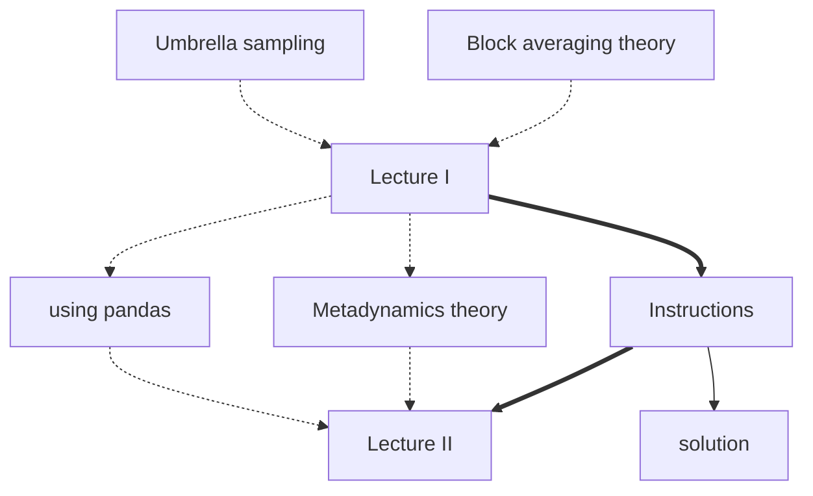

#  PLUMED Masterclass 21.4: Metadynamics

This lesson was given as part of the PLUMED masterclass series in 2021.  It includes:

* A video that explain the theory covered and a second video which shows you how the exercises should be completed.
* A series of exercises that you should try to complete yourself.
* Some supplementary python notebooks that provide further background information on the exercise.

The flow chart shown below indicates the order in which you should consult the resources.  You can click on the nodes to access the various resources.  Follow the thick black lines for the best results.  The resources that are connected by dashed lines are supplmentary resources that you may find useful when completing the exercise. 

This lesson was the fourth masterclass in the 2021 series.  You will likely be able to complete the exercise without completing all the exercises in the first three masterclasses in the series.  However, the third masterclass contains instructions for installing PLUMED using conda and gromacs that you may need to consult if you have not installed it already.  Meanwhile, the second masterclass contains more of the theory behind the block averaging methods that you will be using to complete the exercises here.

